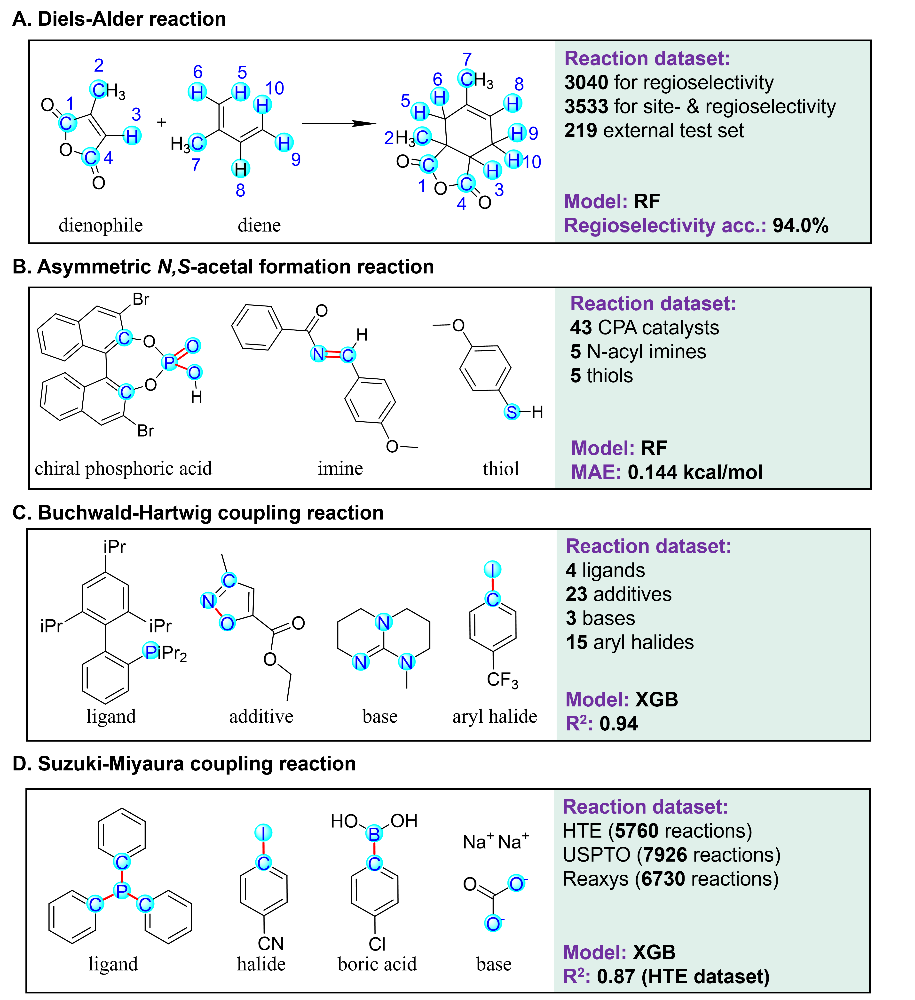

# Reaxtica

Reaxtica: A knowledge-guided machine learning platform for fast and accurate reaction selectivity and yield prediction. The webserver could be found in this [link](http://www.pkumdl.cn:8000/reaxtica/).
	
# Overview

Descriptors, datasets and model descriptions for four reaction types. The colored atoms (blue) and bonds (red) are selected to calculate initial descriptors. 

## Requirement

- Python 3.7.6
- RDKit 2021.03.2
- openbabel 3.1.1
- qmdesc 1.0.6
- scikit-learn 0.23.1
- xgboost 1.5.0
- Pandas 0.23.4
- networkx 2.6.3

## Conda environment
```
conda env create -n Reaxtica -f environment.yml
conda activate Reaxtica
```
## Usage

### DA

```
cd DA
# retrain the regioselectivity
python predict_DA.py -m retrain -dataset DA_input_regio.csv
# retrain the regio- & site-selectivity
python predict_DA.py -m retrain -dataset DA_input_all.csv
# predict the external file
python predict_DA.py -m predict_file -rxn DA_19_all.csv
# predict single reaction
python predict_DA.py -rxn 'COC(=O)N(CC1=CC=CC=C1)C=CC=C.C=CC=O' --temp 20 --acid 1
# (the value of temperature is set as 20 while the acid is set as None as default if they are not typed in)
```

### CPA

```
cd CPA
# retrain random validation
python predict_CPA.py -m retrain -dataset random
# retrain test
python predict_CPA.py -m retrain -dataset test_sub(or test_cat, test_sub-cat)
# predict single reaction
python predict_CPA.py -rxn 'O=P1(O)OC2=C(C3=CC=CC=C3)C=C4C(C=CC=C4)=C2C5=C(O1)C(C6=CC=CC=C6)=CC7=C5C=CC=C7.O=C(C1=CC=CC=C1)/N=C/C2=CC=C(C(F)(F)F)C=C2.SC1=CC=CC=C1C'
# (order := $ligand.$imine.$thiol)
```

### BHC

```
cd BHC
# retrain random validation
python predict_BHC.py -m retrain -dataset random
# retrain test
python predict_BHC.py -m retrain -dataset Test1(or Test2, Test3, Test4)
# predict single reaction
python predict_BHC.py --rxn 'CC(C)C(C=C(C(C)C)C=C1C(C)C)=C1C2=C(P([C@@]3(C[C@@H]4C5)C[C@H](C4)C[C@H]5C3)[C@]6(C7)C[C@@H](C[C@@H]7C8)C[C@@H]8C6)C(OC)=CC=C2OC.CC1=CC(C)=NO1.CN(C)P(N(C)C)(N(C)C)=NP(N(C)C)(N(C)C)=NCC.ClC1=NC=CC=C1'
# (order := $ligand.$additive.$base.$halide)
```

### SMC

```
cd SMC
# retrain random validation for USPTO
python predict_SMC_USPTO.py -m retrain
# retrain random validation for HTE
python predict_SMC_HTE.py -m retrain
# predict single reaction
python predict_SMC_USPTO.py -rxn 'Br[c:8]1[c:3]([C:1]#[N:2])[n:4][cH:5][cH:6][cH:7]1,OB(O)[c:13]1[cH:12][cH:11][c:10]([CH3:19])[cH:15][cH:14]1,c1ccc(P(c2ccccc2)c2ccccc2)cc1,O=C([O-])[O-].[Na+].[Na+],CCO.Cc1ccccc1'
# (order := $halide,$boric_acid,$ligand,$base,$solvent)
# Note that comma is used instead of dot for seperation.
# Or
python predict_SMC_USPTO.py -rxn 'Br[c:2]1[cH:3][n:4][cH:5][c:6]([Br:8])[cH:7]1;CCB(CC)[c:13]1[cH:12][n:11][cH:16][cH:15][cH:14]1;c1ccc(P(c2ccccc2)c2ccccc2)cc1;[K+].[OH-],[Cl-].[Na+],O=S(=O)([O-])[O-].[Mg+2];CCOC(C)=O'
# (order := $halide;$boric_acid;$ligand;$base1,$base2,...;$solvent peration)
# Semicolon is used as the seperator while there is more than one kind of bases.
```
